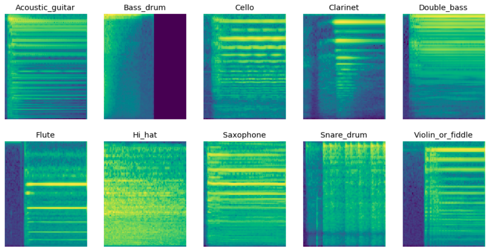
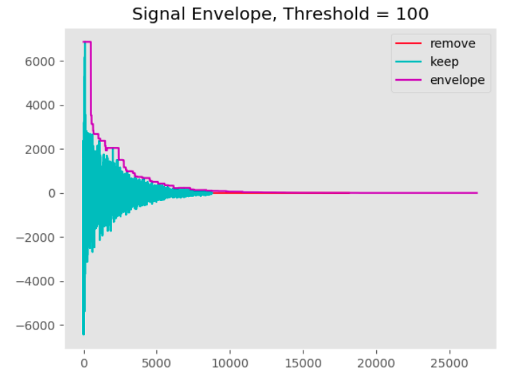
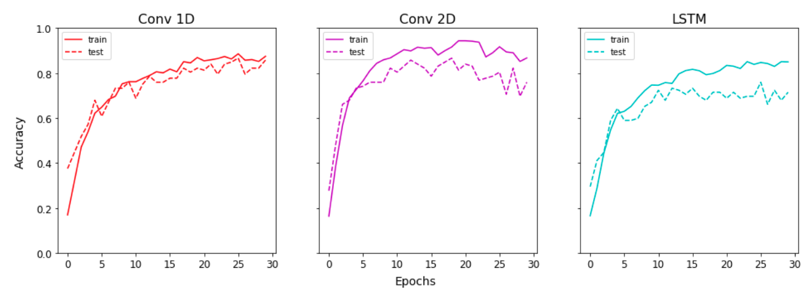
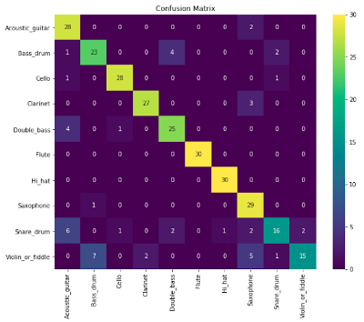
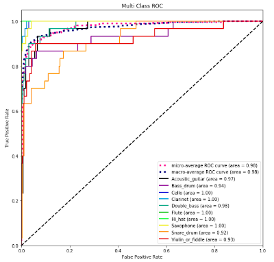

# Audio-Classification (Kapre Version)

Pipeline for prototyping audio classification algorithms with TF 2.3



<!-- TOC -->

- [YouTube](#youtube)
- [Environment](#environment)
- [Jupyter Notebooks](#jupyter-notebooks)
- [Audio Preprocessing](#audio-preprocessing)
- [Training](#training)
- [Plot History](#plot-history)
- [Confusion Matrix](#confusion-matrix)
- [Receiver Operating Characteristic](#receiver-operating-characteristic)
- [Kapre](#kapre)

<!-- /TOC -->

### YouTube

This series has been re-worked. There are new videos to support this repository. It is recommended to follow the new series.

https://www.youtube.com/playlist?list=PLhA3b2k8R3t0SYW_MhWkWS5fWg-BlYqWn

If you want to follow the old videos, restore to a previous commit.

`git checkout 404f2a6f989cec3421e8217d71ef070f3593a84d`

### Environment

```
conda create -n audio python=3.7
activate audio
pip install -r requirements.txt
```

### Jupyter Notebooks

Assuming you have ipykernel installed from your conda environment

`ipython kernel install --user --name=audio`

`conda activate audio`

`jupyter-notebook`

### Audio Preprocessing

clean.py can be used to preview the signal envelope at a threshold to remove low magnitude data

When you uncomment split_wavs, a clean directory will be created with downsampled mono audio split by delta time

`python clean.py`



### Training

Change model_type to: conv1d, conv2d, lstm

Sample rate and delta time should be the same from clean.py

`python train.py`

### Plot History

Assuming you have ran all 3 models and saved the images into logs, check `notebooks/Plot History.ipynb`



`notebooks/Confusion Matrix and ROC.ipynb`

### Confusion Matrix



### Receiver Operating Characteristic



### Kapre

For computation of audio transforms from time to frequency domain on the fly

https://github.com/keunwoochoi/kapre  
https://arxiv.org/pdf/1706.05781.pdf
